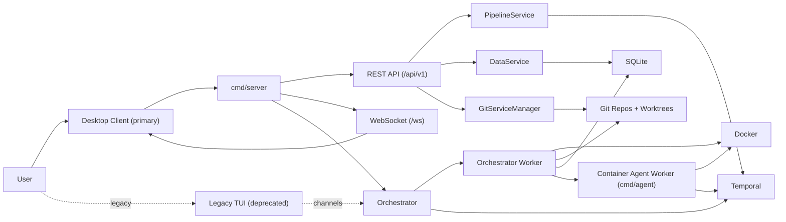

# Components Hierarchy (Server-First)

## Canonical Entry Path

`desktop -> server` is the main application entry flow.

`cmd/app` (TUI) is a legacy path and should be considered deprecated.

## Runtime Flow



## Hierarchy Tree

```text
noldarim
|- Primary runtime
|  |- cmd/server
|  |  |- internal/server (HTTP + WebSocket transport)
|  |  |- internal/orchestrator (runtime owner)
|  |  |  |- services
|  |  |  |  |- PipelineService (mutations, workflow starts/cancel)
|  |  |  |  |- DataService (DB reads/writes)
|  |  |  |  `- GitServiceManager (git concurrency + worktrees)
|  |  |  `- temporal
|  |  |     |- workers (orchestrator worker)
|  |  |     |- workflows (Pipeline/Setup/ProcessingStep/AIObservability)
|  |  |     `- activities (git/container/data/events/ai parsing)
|  |  `- internal/protocol (event/command contracts)
|  `- persistence + infra
|     |- SQLite
|     |- Git repositories/worktrees
|     |- Docker engine
|     `- Temporal server
|
|- Supporting worker runtime
|  `- cmd/agent (container-side Temporal worker)
|
`- Legacy runtime (deprecated as primary path)
   |- cmd/app
   |- internal/tui
   `- cmd/dev/tui/* demos
```

## Notes

- In server mode, orchestrator `cmdChan` exists for compatibility but is not the primary API mutation path.
- WebSocket clients receive lifecycle/AI events from orchestrator `eventChan` fanout.
