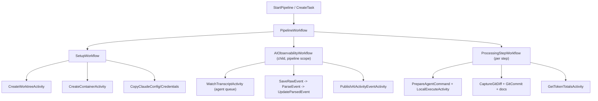

# noldarim Architecture (Server-First)

**Last Updated**: 2026-02-14  
**Architecture Version**: 3.0

## Status

`desktop -> server` is the primary application entry path.

The terminal UI path (`cmd/app` + `internal/tui`) is legacy and should be treated as **deprecated**.

## 1. Architectural Decision

The system is organized around an API server process that owns orchestration and execution infrastructure.

- Primary UX path: desktop client calls HTTP + WebSocket APIs exposed by `cmd/server`.
- Execution core: `internal/orchestrator` + `internal/orchestrator/services` + Temporal workflows.
- Worker execution: run-specific container workers execute AI commands and stream observability signals.
- Persistence and state: SQLite (via GORM) + git worktrees + Docker containers.

This replaces the older model where TUI was treated as the central app shell.

## 2. Runtime Topology

```mermaid
graph TD
    Desktop["Desktop Client (primary)"]
    LegacyTUI["Legacy TUI (deprecated)"]

    ServerMain["cmd/server/main.go"]
    APIServer["internal/server (REST + WS)"]
    Orchestrator["internal/orchestrator.Orchestrator"]
    PipelineService["internal/orchestrator/services.PipelineService"]
    DataService["internal/orchestrator/services.DataService"]
    GitManager["internal/orchestrator/services.GitServiceManager"]

    Temporal[("Temporal Server")]
    OrchWorker["Orchestrator Worker\n(workflows + activities)"]
    AgentWorker["Container Agent Worker\n(cmd/agent)"]

    SQLite[("SQLite")]
    GitRepo[("Git Repositories + Worktrees")]
    Docker[("Docker Engine")]

    Desktop -->|HTTP/WS| ServerMain
    LegacyTUI -->|channels (legacy)| Orchestrator

    ServerMain --> APIServer
    ServerMain --> Orchestrator
    APIServer --> PipelineService
    APIServer --> DataService
    APIServer --> GitManager

    Orchestrator --> DataService
    Orchestrator --> GitManager
    Orchestrator --> PipelineService
    Orchestrator --> OrchWorker
    Orchestrator --> Temporal

    PipelineService --> Temporal

    DataService --> SQLite
    GitManager --> GitRepo
    OrchWorker --> Docker
    OrchWorker --> GitRepo
    OrchWorker --> SQLite

    OrchWorker -->|run-specific task queue| AgentWorker
    AgentWorker --> Docker
    AgentWorker --> Temporal
```

## 3. Entry Points and Roles

### Primary

- `cmd/server/main.go`
  - Loads config and logging.
  - Creates orchestrator (`orchestrator.New(...)`).
  - Starts orchestrator loop and Temporal worker.
  - Starts REST + WebSocket server.
  - Exposes application functionality for desktop client.

### Required Supporting Binary

- `cmd/agent/main.go`
  - Runs inside task containers.
  - Registers run-time workflows/activities for local AI execution and transcript watching.
  - Connects to Temporal using queue injected via env (`TEMPORAL_TASK_QUEUE`).

### Utility

- `cmd/migrate/main.go`: schema migration/validation.

### Legacy / Deprecated as Main UX

- `cmd/app/main.go`: starts orchestrator + Bubble Tea TUI in one process.
- `internal/tui/*`: screen/component stack for terminal UI.
- `cmd/noldarim/main.go` + `internal/cli/*`: CLI commands (still valid for operator workflows, not the primary desktop product path).

## 4. API Server Behavior (`internal/server`)

### 4.1 Request/Response Model

The API server is not a thin proxy to `cmdChan`. It depends directly on services:

- Read endpoints call `DataService` and `GitServiceManager` directly.
- Mutation endpoints call `PipelineService` directly.
- Pipeline progress/events are delivered asynchronously over WebSocket from `eventChan`.

`cmdChan` still exists in `cmd/server/main.go` only because `orchestrator.New(...)` currently requires it; in server mode it idles.

### 4.2 Routes (implemented)

Mounted under `/api/v1` in `internal/server/server.go`:

- `GET /projects`
- `POST /projects`
- `GET /projects/{id}/tasks`
- `POST /projects/{id}/tasks`
- `POST /projects/{id}/tasks/{taskId}/toggle`
- `DELETE /projects/{id}/tasks/{taskId}`
- `GET /projects/{id}/tasks/{taskId}/activity`
- `GET /projects/{id}/commits`
- `GET /projects/{id}/pipelines`
- `POST /projects/{id}/pipelines`
- `POST /pipelines/{runId}/cancel`
- `GET /ws` (WebSocket)

### 4.3 WebSocket Event Fanout

- `EventBroadcaster` consumes orchestrator `eventChan`.
- `ClientRegistry` tracks websocket clients and optional `{project_id, task_id}` filters.
- Events are serialized as envelope:
  - `{"type":"event","event_type":"<go type>","payload":...}`

## 5. Orchestrator Responsibilities

`internal/orchestrator.Orchestrator` owns shared runtime dependencies:

- Data access (`DataService`)
- Git concurrency and repository/worktree management (`GitServiceManager`)
- Container service (`pkg/containers/service`)
- Temporal client and orchestrator worker
- Pipeline business logic (`PipelineService`)

### Important nuance

In server-first mode, orchestrator command-loop handlers are mostly a compatibility layer for legacy command/channel callers. The API path uses service methods directly.

## 6. Pipeline Execution Architecture

Pipelines are the canonical execution unit. "Task" execution is modeled as a single-step pipeline.

### 6.1 Workflow Graph



### 6.2 Queue Boundaries

- Orchestrator queue (`cfg.Temporal.TaskQueue`): orchestration workflows and DB/git/container activities.
- Run-specific queue (`task-queue-<...>`): container worker execution for step-level local command execution and transcript watching.

### 6.3 Setup Guarantees

`SetupWorkflow` is the setup source of truth and uses compensating actions for cleanup on failure:

- Create and persist `PipelineRun`
- Create worktree
- Create/start container
- Copy Claude configuration/credentials
- Update run metadata and emit `PipelineCreated`

## 7. Data and Side Effects

### 7.1 Persistence

- SQLite through `internal/orchestrator/database` + GORM models.
- Core persisted entities:
  - `projects`, `tasks`
  - `pipeline_runs`, `step_results`
  - `ai_activity_records`

### 7.2 Filesystem and Git

- Per-run worktrees created from project repositories.
- Step docs/history generated during step execution.
- Git diff + commit captured per step.

### 7.3 Containers

- Containers are created and managed by container activities.
- Agent worker process (`/app/agent`) is started in container.
- Container env includes Temporal connectivity and run/task identifiers.

## 8. Protocol and Event Contracts

`internal/protocol` defines command/event contracts.

- Legacy channel mode:
  - Commands: UI -> orchestrator via `cmdChan`
  - Events: orchestrator -> UI/server via `eventChan`
- Server-first mode:
  - REST performs direct service invocations.
  - Long-running lifecycle updates still publish protocol events on `eventChan` for WebSocket clients.

Key lifecycle event families:

- `TaskLifecycleEvent`
- `PipelineLifecycleEvent`
- `AIActivityRecord` (streamed as event payload)
- `ErrorEvent`, `PipelineRunStartedEvent`, `PipelineCancelledEvent`

## 9. Deprecation Direction

The current architecture direction is explicit:

1. Primary product flow is `desktop -> cmd/server`.
2. `cmd/app`/TUI path remains for compatibility/dev tooling only.
3. New product features should be surfaced via server APIs + WebSocket event streams, not new TUI-first command paths.

## 10. Code References

- Primary app server: `cmd/server/main.go`
- Legacy TUI app: `cmd/app/main.go`
- API surface: `internal/server/server.go`, `internal/server/handlers.go`, `internal/server/websocket.go`, `internal/server/events.go`
- Orchestrator core: `internal/orchestrator/orchestrator.go`
- Business services: `internal/orchestrator/services/pipeline_service.go`, `internal/orchestrator/services/data_service.go`
- Temporal worker wiring: `internal/orchestrator/temporal/workers/worker.go`
- Workflow implementations:
  - `internal/orchestrator/temporal/workflows/pipeline.go`
  - `internal/orchestrator/temporal/workflows/setup.go`
  - `internal/orchestrator/temporal/workflows/processing_step.go`
  - `internal/orchestrator/temporal/workflows/ai_observability.go`
- Agent worker: `cmd/agent/main.go`
- Protocol contracts: `internal/protocol/*.go`
